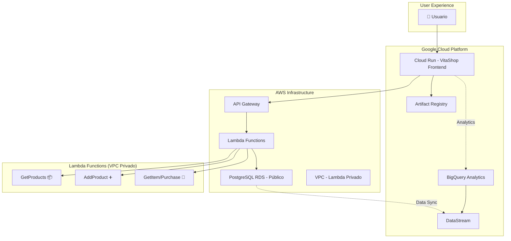
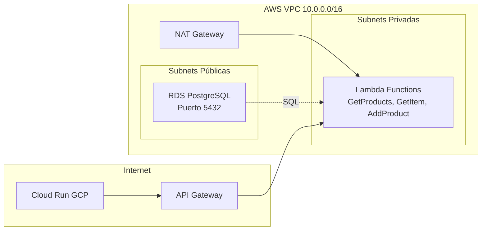

# 🧬 VitaShop: E-commerce Híbrido Multi-Cloud


**VitaShop** es una tienda de vitaminas y suplementos nutricionales que demuestra una arquitectura híbrida multi-cloud robusta, utilizando AWS para backend/base de datos y Google Cloud Platform para frontend/analytics, desplegado completamente con Infrastructure as Code usando Terraform.

## 🏗️ Arquitectura del Sistema



### Componentes Principales

| Componente | Tecnología | Propósito | Cloud Provider | Configuración |
|------------|------------|-----------|----------------|---------------|
| **VitaShop Frontend** | Flask + HTML/CSS/JS | Tienda de vitaminas responsive | GCP Cloud Run | Inline code deployment |
| **API Gateway** | AWS API Gateway REST | Orquestador de APIs backend | AWS | CORS habilitado |
| **Microservicios** | AWS Lambda (Python) | Lógica de negocio e inventario | AWS | VPC privado |
| **Base de Datos** | PostgreSQL RDS | Catálogo de productos y stock | AWS | Público con VPC |
| **Container Registry** | Artifact Registry | Sin uso (código inline) | GCP | Disponible para futuro |
| **Analytics** | BigQuery + DataStream | Pipeline de datos de ventas | GCP | Tiempo real |
| **Infrastructure** | Terraform | Infrastructure as Code | Multi-Cloud | Versión 1.6+ |

## 🛒 Funcionalidades de VitaShop

### 💊 Catálogo de Productos
- **Categorías especializadas**: Vitaminas, Minerales, Proteínas, Omega, Antioxidantes, Probióticos, Energía, Inmunidad
- **Iconos por categoría**: 💊 🧲 💪 🐟 🍇 🦠 ⚡ 🛡️
- **Stock en tiempo real** conectado a PostgreSQL
- **Precios dinámicos** con 2 decimales de precisión

### 🛒 Carrito de Compras Inteligente
- **LocalStorage persistence**: El carrito se mantiene entre sesiones
- **Sidebar deslizante** con animaciones CSS
- **Control de cantidad** con validación de stock
- **Cálculo automático** de totales
- **Gestión de inventario** en tiempo real

### 🎯 Experiencia de Usuario
- **Diseño responsive** optimizado para móvil y desktop
- **Tema verde** especializado en salud y bienestar
- **Carga dinámica** con sistema de fallback
- **Debugging integrado** con logs detallados
- **Botones de prueba** para diagnosticar conectividad

## 📁 Estructura del Proyecto

```
DP-3/
├── 📂 terraform/                   # Infrastructure as Code
│   ├── 🏗️ main.tf                 # Configuración completa (1400+ líneas)
│   │   ├── 🌐 VPC + Subnets       # Red privada para Lambda
│   │   ├── 🔒 Security Groups     # RDS público, Lambda privado
│   │   ├── ⚡ Lambda Functions     # Código inline + ZIP files
│   │   ├── 🚪 API Gateway REST    # Endpoints con CORS
│   │   ├── 🗄️ RDS PostgreSQL      # Base de datos pública
│   │   ├── 🐳 Cloud Run Service   # Frontend Flask inline
│   │   └── 📊 BigQuery + Stream   # Analytics pipeline
│   ├── 📝 variables.tf             # 30+ variables configurables
│   ├── 📤 outputs.tf               # URLs y endpoints
│   ├── ⚙️ providers.tf             # AWS + GCP + Archive
│   ├── 📋 terraform.tfvars.example # Template de configuración
│   └── 📂 lambda_src/              # Código fuente Lambda
│       ├── 📂 get_products/        # Catálogo completo
│       │   ├── 🐍 main.py          # pg8000 + JSON response
│       │   └── 📋 requirements.txt # pg8000==1.30.3
│       ├── 📂 add_product/         # CRUD productos
│       │   ├── 🐍 main.py          # Validación + Insert
│       │   └── 📋 requirements.txt
│       └── 📂 get_item/            # Compras + Stock
│           ├── 🐍 main.py          # Transacciones + Lock
│           └── 📋 requirements.txt
├── 📂 scripts/                     # Database Setup
│   ├── 🐍 setup_database.py       # Script de inicialización
│   ├── 🗄️ init_database.sql       # Schema + Datos vitaminas
│   └── 📋 requirements.txt         # psycopg2
└── 📖 README.md                    # Esta documentación
```

## 🚀 Quick Start

### Prerrequisitos

- **Terraform >= 1.6** (probado con 1.6.6)
- **Cuenta AWS** con permisos administrativos
- **Cuenta GCP** con proyecto y facturación habilitados
- **AWS CLI** configurado (`aws configure`)
- **GCP CLI** configurado (`gcloud auth application-default login`)

### 1. Configuración de Variables

```bash
cd terraform
cp terraform.tfvars.example terraform.tfvars
```

**Configuración mínima requerida**:
```hcl
# Identificación del proyecto
project_name = "vitashop-prod"

# Google Cloud Platform
gcp_project_id = "tu-proyecto-gcp-123456"
gcp_region     = "europe-west1"

# Amazon Web Services  
aws_region = "eu-central-1"

# Base de datos PostgreSQL
db_name           = "ecommerce"
db_username       = "vitashop_user"
db_password       = "VitaShop2024_SecurePass!"
datastream_username = "datastream"
datastream_password = "DataStream2024_Pass!"

# BigQuery Analytics
bigquery_dataset_id       = "vitashop_analytics"
bigquery_dataset_location = "EU"
```

### 2. Despliegue Completo

```bash
# Inicializar Terraform
terraform init

# Verificar plan de despliegue
terraform plan

# Aplicar infraestructura (15-20 minutos)
terraform apply

# Obtener URLs importantes
terraform output
```

### 3. Verificación Post-Despliegue

```bash
# URL principal de VitaShop
echo "🛒 VitaShop: $(terraform output -raw cloud_run_url)"

# API Gateway para desarrollo
echo "🔌 API: $(terraform output -raw api_gateway_invoke_url)"

# Base de datos para administración
echo "🗄️ DB: $(terraform output -raw rds_public_endpoint)"
```

## 🔌 Arquitectura de APIs

### Endpoints de VitaShop (Frontend Flask)

| Método | Endpoint | Descripción | Funcionalidad |
|--------|----------|-------------|---------------|
| `GET` | `/` | Página principal | Tienda completa con carrito |
| `GET` | `/api/products` | Lista productos | Proxy a Lambda + Fallback |
| `GET` | `/api/item/<id>` | Producto individual | Detalles específicos |
| `POST` | `/api/purchase` | Procesar compra | Carrito completo → Lambda |
| `GET` | `/debug` | Información debug | Estado APIs y configuración |
| `GET` | `/init-db` | Inicializar BD | Poblar productos base |
| `GET` | `/health` | Health check | Status del servicio |

### Lambda Functions (AWS)

| Función | Método HTTP | Endpoint API Gateway | Propósito |
|---------|-------------|---------------------|-----------|
| **GetProducts** | `GET` | `/products` | Retorna catálogo completo desde PostgreSQL |
| **GetItem** | `GET` | `/item?id={id}` | Obtiene producto específico |
| **GetItem** | `POST` | `/item` | Procesa compra y actualiza stock |
| **AddProduct** | `POST` | `/product` | Añade nuevo producto (admin) |

### Estructura de Datos

#### Producto (PostgreSQL + JSON)
```json
{
  "id": 1,
  "name": "Vitamina C 1000mg",
  "category": "Vitaminas",
  "price": 15.99,
  "stock": 50,
  "created_at": "2024-01-15T10:30:00Z",
  "updated_at": "2024-01-15T10:30:00Z"
}
```

#### Carrito de Compras (Frontend)
```json
{
  "cart": [
    {"id": 1, "name": "Vitamina C 1000mg", "price": 15.99, "quantity": 2},
    {"id": 3, "name": "Proteína Whey", "price": 45.99, "quantity": 1}
  ],
  "customer_info": {
    "name": "Juan Pérez",
    "email": "juan@email.com",
    "phone": "+34612345678"
  }
}
```

## 🛠️ Desarrollo y Personalización

### Base de Datos PostgreSQL

**Tabla principal: `productos`**
```sql
CREATE TABLE productos (
    id SERIAL PRIMARY KEY,
    name VARCHAR(255) NOT NULL,
    category VARCHAR(100) NOT NULL,
    price DECIMAL(10,2) NOT NULL,
    stock INTEGER NOT NULL DEFAULT 0,
    created_at TIMESTAMP DEFAULT CURRENT_TIMESTAMP,
    updated_at TIMESTAMP DEFAULT CURRENT_TIMESTAMP
);

-- Datos de ejemplo (26 productos)
INSERT INTO productos (name, category, price, stock) VALUES
('Vitamina C 1000mg', 'Vitaminas', 15.99, 50),
('Omega-3 Fish Oil 1000mg', 'Omega', 24.99, 30),
('Proteína Whey Chocolate', 'Proteínas', 45.99, 25),
-- ... 23 productos más
```

### Configuración de Red

```hcl
# VPC para Lambda Functions (Privado)
resource "aws_vpc" "main" {
  cidr_block = "10.0.0.0/16"
}

# RDS en subnet pública (acceso externo)
resource "aws_db_instance" "main_database" {
  publicly_accessible = true
  vpc_security_group_ids = [aws_security_group.rds_sg.id]
}

# Lambda Functions en subnet privada
resource "aws_lambda_function" "get_products" {
  vpc_config {
    subnet_ids         = [aws_subnet.private_1.id, aws_subnet.private_2.id]
    security_group_ids = [aws_security_group.lambda_sg.id]
  }
}
```

### Frontend JavaScript Avanzado

```javascript
// Sistema de categorías con iconos
const categoryIcons = {
    "Vitaminas": "💊",
    "Minerales": "⚡", 
    "Proteínas": "💪",
    "Omega": "🐟",
    "Antioxidantes": "🍇",
    "Probióticos": "🦠",
    "Energía": "⚡",
    "Inmunidad": "🛡️"
};

// Carrito persistente con LocalStorage
function saveCart() {
    localStorage.setItem("cart", JSON.stringify(cart));
}

// Sistema de debugging integrado
function testConnectivity() {
    // Prueba endpoints y muestra logs detallados
}
```

## 🔒 Seguridad y Configuración

### Medidas de Seguridad Implementadas

- **🔐 Variables sensibles**: Manejadas por Terraform sin hardcoding
- **🛡️ IAM Roles específicos**: Permisos mínimos para Lambda execution
- **🌐 VPC Security Groups**: Lambda privado, RDS público controlado
- **📝 API Gateway CORS**: Configurado para frontend específico
- **🔄 Environment Variables**: Credenciales DB vía variables de entorno
- **🚫 Sin secretos en código**: Todo via Terraform variables

### Configuración de Red Híbrida



## 📊 Analytics y Monitoreo

### Pipeline de Datos en Tiempo Real

1. **PostgreSQL RDS** → Transacciones de compras
2. **Google DataStream** → Sincronización automática
3. **BigQuery** → Analytics y reportes
4. **Dashboards GCP** → Visualización de métricas

### Métricas de Negocio Disponibles

| Métrica | Fuente | Disponibilidad |
|---------|--------|----------------|
| **Ventas por categoría** | BigQuery | Tiempo real |
| **Productos más vendidos** | PostgreSQL | Inmediato |
| **Stock bajo** | Lambda GetProducts | En vivo |
| **Carritos abandonados** | Frontend Analytics | Sesión |

### Métricas Técnicas

| Componente | Métricas Clave | Dashboard |
|------------|----------------|-----------|
| **Cloud Run** | Request latency, CPU usage, Memory | GCP Monitoring |
| **Lambda** | Invocations, Duration, Errors, Throttles | CloudWatch |
| **API Gateway** | Request count, Latency, Error rate | CloudWatch |
| **RDS** | Connections, Query time, CPU | Performance Insights |

## 🧪 Testing y Debugging

### Sistema de Debugging Integrado

VitaShop incluye herramientas de debugging avanzadas:

```javascript
// Logs automáticos en consola del navegador
console.log("🚀 VitaShop iniciando...");
console.log("📦 Products data:", productsData);

// Botones de prueba en la interfaz
🔄 Cargar Productos  // Prueba conexión real
📦 Productos de Prueba  // Fallback estático
```

### Endpoints de Diagnóstico

```bash
# Verificar estado general
curl https://your-vitashop-url/health

# Debug información técnica
curl https://your-vitashop-url/debug

# Inicializar base de datos
curl https://your-vitashop-url/init-db

# Probar API Gateway directamente
curl https://your-api-gateway/prod/products
```

### Resolución de Problemas Comunes

| Síntoma | Causa Probable | Solución |
|---------|----------------|----------|
| **Productos no cargan** | Lambda timeout o DB connection | Usar `/debug` + CloudWatch logs |
| **Carrito no funciona** | JavaScript error | F12 → Console, usar "Productos de Prueba" |
| **Error 502 API Gateway** | Lambda cold start o error | Revisar logs en CloudWatch |
| **RDS connection failed** | Security Group restrictivo | Verificar ingress rules 5432 |
| **Cloud Run 503** | Container startup issue | Revisar logs en GCP Console |

### Comandos de Diagnóstico

```bash
# Logs detallados de Cloud Run
gcloud run services logs read vitashop-frontend --region=europe-west1

# Logs de Lambda specific
aws logs tail /aws/lambda/dp3-fresh-123-getProducts --follow

# Estado de RDS
aws rds describe-db-instances --db-instance-identifier dp3-fresh-123-newdb-456

# Test directo a base de datos
psql -h your-rds-endpoint -U vitashop_user -d ecommerce -c "SELECT COUNT(*) FROM productos;"
```

## 💰 Consideraciones de Costos

### Estimación Mensual Optimizada (EUR)

| Servicio AWS/GCP | Configuración | Costo Estimado | Detalles |
|-------------------|---------------|----------------|----------|
| **Cloud Run** | 2 vCPU, 512Mi | €8-15 | Pay-per-request, auto-scaling |
| **Lambda Functions** | 3 funciones, 128MB | €3-8 | Free tier + ejecuciones |
| **RDS t3.micro** | PostgreSQL 20GB | €15-25 | Instancia + almacenamiento |
| **API Gateway** | REST + CORS | €2-6 | Por número de requests |
| **BigQuery** | 1GB/mes | €1-3 | Queries + almacenamiento |
| **VPC + Networking** | 2 subnets, NAT | €5-12 | Transferencia de datos |

**💡 Total optimizado**: €34-69/mes (para 1000-10000 requests/mes)

### Optimizaciones de Costo

- **Lambda cold start**: Funciones simples con inicio rápido
- **RDS t3.micro**: Suficiente para testing y pequeña escala
- **Cloud Run scaling to zero**: No costos cuando no hay tráfico
- **BigQuery on-demand**: Solo paga por queries ejecutadas

## 🚀 Deployment Avanzado

Ver [DEPLOYMENT.md](DEPLOYMENT.md) para:
- Configuración detallada paso a paso
- Troubleshooting específico por componente
- Configuración de CI/CD
- Backup y disaster recovery
- Scaling y performance tuning

## 📚 Referencias Técnicas

### Documentación Oficial
- [Terraform AWS Provider v5](https://registry.terraform.io/providers/hashicorp/aws/latest/docs)
- [Terraform Google Provider v5](https://registry.terraform.io/providers/hashicorp/google/latest/docs)
- [AWS Lambda + VPC Configuration](https://docs.aws.amazon.com/lambda/latest/dg/vpc.html)
- [Google Cloud Run Documentation](https://cloud.google.com/run/docs)
- [PostgreSQL RDS Best Practices](https://docs.aws.amazon.com/AmazonRDS/latest/UserGuide/CHAP_BestPractices.html)

### Arquitecturas de Referencia
- [AWS Well-Architected Framework](https://aws.amazon.com/architecture/well-architected/)
- [Google Cloud Architecture Center](https://cloud.google.com/architecture)
- [Multi-Cloud Patterns](https://cloud.google.com/architecture/hybrid-and-multi-cloud-patterns)

---

## 🤝 Contribución y Desarrollo

1. **Fork** el repositorio
2. **Feature branch**: `git checkout -b feature/nueva-categoria-suplementos`
3. **Terraform changes**: Actualizar infrastructure si es necesario
4. **Testing**: Verificar con `terraform plan` y `terraform apply`
5. **Commit**: `git commit -m 'Add nueva categoría de suplementos deportivos'`
6. **Pull Request**: Incluir descripción de cambios de infraestructura

## 📄 Licencia

MIT License - Ver [LICENSE](LICENSE) para detalles completos.

---

<div align="center">

**🧬 VitaShop - Vitaminas y Suplementos**  
*Desarrollado con ❤️ para demostrar arquitecturas híbridas multi-cloud*


</div>